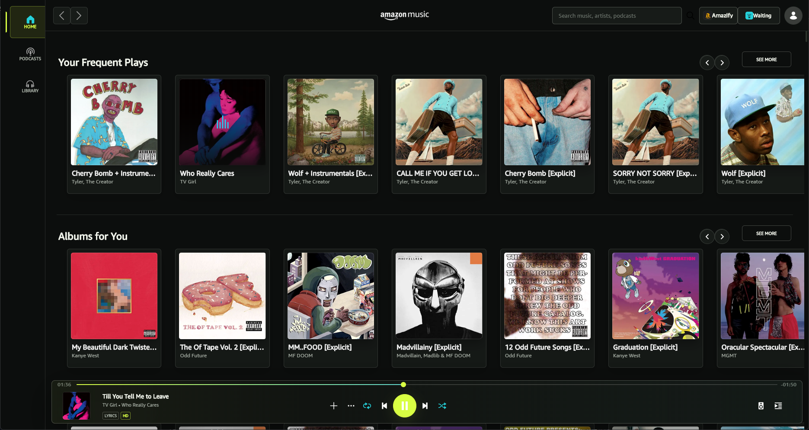

<p align="center">
  
</p>

<h1 align="center">Amazify</h1>

<p align="center">
  <strong>A runtime customization platform and plugin marketplace for Amazon Music on Windows.</strong>
</p>

<p align="center">
  Inspired by <a href="https://spicetify.app/">Spicetify</a>. Amazify keeps the official Amazon Music desktop app in charge of playback, accounts, downloads, notifications, and DRM while adding a reversible plugin layer around its interface.
</p>

<p align="center">
  <a href="https://github.com/eripum9/Amazify/releases/latest"></a>
  <a href="https://github.com/eripum9/Amazify/releases"></a>
  <a href="https://github.com/eripum9/Amazify/actions/workflows/ci-windows.yml"></a>
  <a href="https://github.com/eripum9/Amazify/actions/workflows/security.yml"></a>
  <a href="LICENSE"></a>
</p>

<p align="center">
  <a href="https://github.com/eripum9/Amazify/releases/latest/download/AmazifySetup.exe"><strong>Download Amazify for Windows</strong></a>
</p>

> [!IMPORTANT]
> Amazify is an unofficial community project and is not affiliated with Amazon. It relies on Amazon Music's internal desktop interface, so an Amazon Music update can temporarily break selectors or plugins.

## What Amazify Does

Amazify launches or attaches to the official Amazon Music desktop app, validates its local Chromium DevTools target, and injects an in-app runtime. Plugins can then alter presentation and behavior without modifying Amazon Music's packaged files on disk.

- **Reversible runtime injection** - disabling Amazify or a plugin removes its registered DOM, styles, and handlers.
- **In-app marketplace** - download, update, reinstall, enable, or disable plugins without leaving Amazon Music.
- **Verified plugin catalog** - catalog entries pin an immutable Git commit and declare every file's SHA-256 and byte size.
- **Automatic plugin update checks** - opening the marketplace refreshes the catalog and compares installed manifest versions.
- **Persistent launch daemon** - starts at sign-in by default, handles launch requests, and remains ready after Amazon Music closes.
- **Fast reconnects** - discovers DevTools ports from running Amazon Music processes and probes valid targets concurrently.
- **Desktop integration** - provides the `Amazon Music (Amazify)` Start Menu shortcut, optional Desktop and taskbar shortcuts, and a real `amazify` CLI command.
- **Application updates** - checks official final GitHub releases, verifies the installer digest, and asks before opening the normal installer.
- **Plugin assets** - plugins can package images, SVGs, fonts, and JSON alongside JavaScript and CSS.
- **Authenticated local bridge** - native operations use an allowlisted, credentialed loopback bridge with a DevTools binding fallback.

## Install

### Requirements

- Windows 10 or later
- The official Amazon Music desktop app

Python is not required when using the installer.

### Windows installer

1. Download [AmazifySetup.exe](https://github.com/eripum9/Amazify/releases/latest/download/AmazifySetup.exe).
2. Run the installer and choose whether to start the daemon at sign-in and create Desktop or taskbar shortcuts.
3. Open **Amazon Music (Amazify)** from Start, or run `amazify run` from a terminal.
4. Open the Amazify menu inside Amazon Music to install and enable plugins.

The installer places Amazify under `%LOCALAPPDATA%\Programs\Amazify`, adds the CLI directory to the user `PATH`, and registers a normal uninstaller. Startup at sign-in is selected by default. Taskbar pinning is best-effort because some Windows versions reject programmatic pinning; the Start Menu shortcut can always be pinned manually.

> [!NOTE]
> The v1.0.0 installer is not Authenticode signed. Windows SmartScreen may therefore show an unrecognized-app warning. The release page publishes the installer SHA-256 for independent verification.

## Use The CLI

Running `amazify` without a subcommand shows all available commands.

| Command | Purpose |
|---|---|
| `amazify run` | Start the daemon if needed, launch or focus Amazon Music, and inject Amazify |
| `amazify run --foreground` | Run attached in the current terminal for troubleshooting |
| `amazify daemon start` | Start the background daemon |
| `amazify daemon status` | Show daemon status |
| `amazify daemon stop` | Stop the background daemon |
| `amazify list-candidates` | Show discovered Amazon Music launch candidates |
| `amazify shortcuts install` | Recreate Amazify launch shortcuts |
| `amazify update check` | Check the official latest final release |
| `amazify update install` | Confirm, download, verify, and open the latest installer |
| `amazify --version` | Print the installed Amazify version |

`amazify run` returns after handing the request to the daemon. Closing the terminal or Amazon Music does not stop the daemon.

## Plugin Marketplace

The official schema-v2 catalog is [`plugin_catalog.json`](plugin_catalog.json). Each package declares a trust tier, source repository, immutable 40-character source commit, plugin root, manifest, and the expected SHA-256 and byte size of every downloaded file. Amazify derives raw GitHub URLs from that metadata and validates all content before installation.

Downloaded plugins are disabled by default and must be enabled explicitly. A verified hash proves that the downloaded code matches the catalog entry; it does not prove that third-party code is safe. Review a community plugin's source, author, permissions, and pinned commit before enabling it.

### Current stock plugins

Stock plugins are reviewed catalog entries maintained in this repository. Their source lives under [`sample_plugins/`](sample_plugins/) and is not preinstalled by the Windows installer.

| Plugin | Version | Type | Description |
|---|---:|---|---|
| [True Big Mode](sample_plugins/amazify.true-big-mode/) | `0.1.5` | UI | Replaces Big Mode with a full-window lyrics layout, dynamic album-art ambience, custom playback controls, a draggable timeline, and a centered no-lyrics state |
| [Signal Studio](sample_plugins/amazify.theme.signal-studio/) | `0.1.0` | Theme | Reworks the full interface with a compact navigation rail, custom typography and textures, reactive ambience, redesigned panels, and a floating transport |

True Big Mode is inspired by [Spicy Lyrics](https://github.com/Spikerko/spicy-lyrics).

### Signal Studio



*Signal Studio on Home with its navigation rail, library surfaces, and floating playback transport.*

### True Big Mode


*True Big Mode with album-derived ambience, synchronized lyrics, track details, and the custom timeline.*

## How It Fits Together

```text
Amazon Music (Amazify) shortcut / amazify run
                    |
                    v
          Persistent Amazify daemon
                    |
                    v
       Validated local DevTools target
                    |
                    v
  Authenticated bridge + injected runtime
                    |
                    v
       User-enabled verified plugins
```

Amazify does not replace Amazon Music's playback service or account handling. It does not intentionally read or export passwords, cookies, DRM material, or downloaded music.

## Develop A Plugin

A plugin is a directory containing `manifest.json` plus optional JavaScript, CSS, and declared assets.

```json
{
  "id": "example.my-plugin",
  "name": "My Plugin",
  "version": "0.1.0",
  "author": "Your Name",
  "type": "ui",
  "description": "A short user-facing description.",
  "entry": "plugin.js",
  "styles": ["style.css"],
  "assets": {
    "logo": "assets/logo.svg"
  },
  "permissions": ["dom-read", "dom-write", "dom-style"],
  "amazonMusic": {
    "testedAppVersions": [],
    "target": "desktop"
  }
}
```

Plugin JavaScript receives `Amazify`, `manifest`, and `source`. Return a cleanup function to undo listeners and runtime changes when the plugin is disabled. Plugin-owned DOM should use `data-amazify-plugin-id`, and every privileged capability should be declared in the manifest.

Declared `dom-read`, `dom-write`, `dom-style`, and `network` permissions are disclosure and consent signals, not a complete JavaScript sandbox. Plugins run in the Amazon Music renderer and can affect what the signed-in user can see and do.

For assets, use `Amazify.assets.url(manifest.id, "logo")` or `source.assetUrl("logo")` from JavaScript. Matching CSS `url(...)` references are rewritten to validated data URLs at runtime.

## Security

Amazify treats its DevTools connection, native bridge, catalog, plugin installation path, and application updater as security boundaries. The main controls include loopback-only listeners, session credentials, exact command allowlists, origin checks, bounded downloads, redirect validation, immutable source commits, staged installs, digest verification, and explicit confirmation for application updates.

Plugins are still renderer-level code. `stock` means the exact catalog revision was reviewed and tested by Amazify; it does not mean formally audited or risk-free.

- Read the [security policy](SECURITY.md) before enabling or publishing privileged plugins.
- See the [threat model](docs/threat-model.md) and [network endpoint inventory](docs/network-endpoints.md) for trust boundaries and residual risks.
- Report vulnerabilities through [GitHub private vulnerability reporting](https://github.com/eripum9/Amazify/security/advisories/new), not a public issue.

## Develop Amazify

### Source environment

Amazify supports Python 3.10 or later. CPython 3.12.10 is used for reproducible CI and Windows packaging.

```powershell
git clone https://github.com/eripum9/Amazify.git
cd Amazify
py -3.12 -m venv .venv
.\.venv\Scripts\python.exe -m pip install --require-hashes --only-binary=:all: -r requirements-dev.lock
.\.venv\Scripts\python.exe -m pip install --no-build-isolation --no-deps -e .
```

### Test

```powershell
.\.venv\Scripts\python.exe -m pytest tests --cov=amazify --cov-report=term-missing --cov-fail-under=45
.\.venv\Scripts\python.exe -m ruff check amazify packaging tests .github/scripts --select E9,F63,F7,F82
```

The Windows CI and candidate workflows additionally run pinned Pyright checks, dependency audits, executable smoke tests, and an isolated installer/uninstaller cycle.

### Build Windows artifacts

Local packaging requires [Inno Setup 6](https://jrsoftware.org/isdl.php). The official candidate workflow uses CPython 3.12.10 and Inno Setup 6.7.3.

```powershell
.\.venv\Scripts\python.exe -m pip install --require-hashes --only-binary=:all: -r requirements-build.lock
.\Build.bat
```

| Output | Purpose |
|---|---|
| `dist\amazify.exe` | Standalone console CLI |
| `dist\amazifyw\amazifyw.exe` | Windowless shortcut launcher |
| `dist\AmazifySetup.exe` | Interactive Windows installer |

The manual [Build Windows Candidate](docs/candidate-builds.md) workflow validates current `main`, builds and tests the exact version, generates checksums and CycloneDX SBOMs, records Defender results, and creates provenance attestations. It uploads a private Actions artifact only and cannot publish a release. Release publication remains a separate explicit maintainer action.

Dependency update and locking rules are documented in [dependency management](docs/dependency-management.md). The accepted application release format is documented in [application updates](docs/application-updates.md).

## Repository Layout

```text
amazify/              Python launcher, daemon, bridge, runtime, updater, and plugin manager
sample_plugins/       Source for the maintained stock catalog plugins
packaging/            PyInstaller entry points, icons, and Inno Setup configuration
tests/                Unit, contract, security-baseline, and workflow tests
docs/                 Security, dependency, updater, and candidate-build documentation
plugin_catalog.json   Integrity-pinned marketplace index
Build.bat             Local Windows executable and installer build
```

Runtime data is stored outside the repository:

| Path | Contents |
|---|---|
| `%APPDATA%\Amazify\plugins` | Installed plugins |
| `%APPDATA%\Amazify` | Configuration and daemon state |
| `%APPDATA%\Amazify\logs` | Runtime logs |

## Contributing

Focused bug fixes, runtime compatibility updates, documentation improvements, and plugins are welcome. Create a feature branch, use the locked development environment, include focused tests where practical, and open a pull request describing the behavior and verification performed.

## Credits

- [Spicetify](https://spicetify.app/) and its community for pioneering music-app customization marketplaces.
- [Spicy Lyrics](https://github.com/Spikerko/spicy-lyrics) for the visual inspiration behind True Big Mode.

## License

Amazify is available under the [MIT License](LICENSE).
